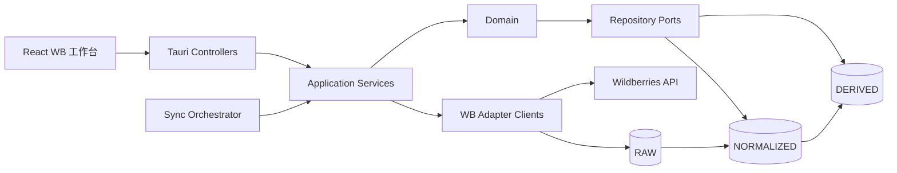
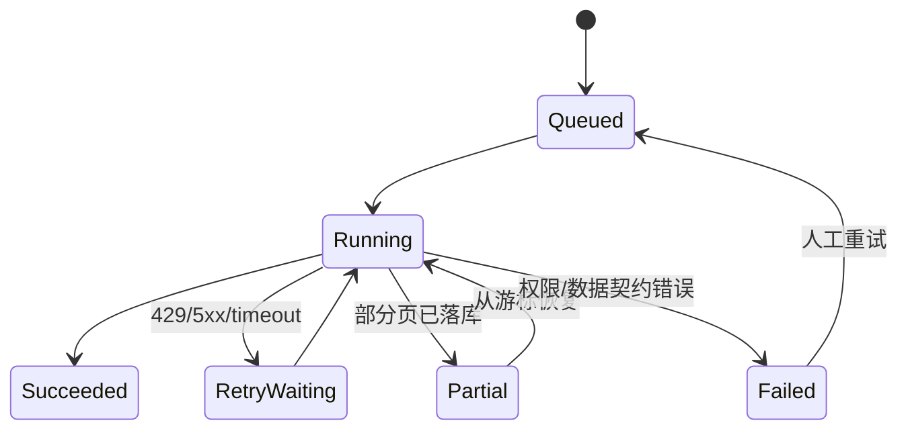

# WBerp 本地优先重构：仓库审计与目标架构

> 状态：架构评审稿。基于仓库提交 `d2519130d722a5a904313aefdde6e37dd0451b9f`。本阶段不删除旧代码、不改数据库、不接入未经核实的 API。

## 1. 结论

现有 WB 功能适合作为迁移数据源和行为参考，不适合继续扩展。它把页面、同步、API、业务计算和 SQLite 表紧密连接在一起，并以 `nm_id` 充当主要商品身份。新 WBerp 应采用本地优先的分层模块化架构，以内部 SKU 作为主身份，以 `MarketplaceListing` 保存 Wildberries 外部标识，并把数据分为 RAW、NORMALIZED、DERIVED 三层。

“删除旧 WB”应分两步完成：先在新命名空间构建 v2、迁移并核对数据；验证通过后再删除旧页面、命令和表。直接删除会丢失订单、广告、库存、成本、店铺密钥和历史同步记录，并可能误伤与 Ozon 共用的应用外壳。

交互式架构图见 [wildberries-erp-architecture.html](./wildberries-erp-architecture.html)。

## 2. 当前仓库审计

| 能力 | 当前实现 | 判断 |
|---|---|---|
| 前端 | React 19、TypeScript 5.9、Vite 7、Tauri 2 | 保留应用外壳和通用组件；WB 页面重新拆分 |
| 后端 | Rust 2021、Tauri commands、`ureq` | 保留运行时；建立 controller/application/domain/infrastructure 分层 |
| 数据库 | SQLite，`rusqlite`，单个 `data-next/wb/wb_analytics.db` | 迁移到按店铺隔离的 WB v2 数据库；旧库先只读保留 |
| ORM | 无，直接 SQL | 可继续使用 repository + 显式 SQL；禁止 UI/用例直接写 SQL |
| 身份认证 | 本地桌面应用，无用户认证 | 本地阶段建立操作者身份与会话抽象，为后续多用户留接口 |
| RBAC | 无 | 新建角色/权限点，至少覆盖查看、同步、改价、广告、采购、财务、密钥管理 |
| 任务队列 | 无正式队列 | 新建 SQLite 持久化 SyncJob/SyncJobRun 调度器 |
| 定时任务 | 无可靠后台调度；存在页面轮询 | 调度移入 Rust 后端，应用重启后可恢复 |
| 缓存 | SQLite 结果兼作缓存 | DERIVED 层承载可重建快照；不要把缓存当事实数据 |
| 部署 | Windows Tauri EXE | 保留本地部署，数据库迁移必须版本化、可回滚 |
| 测试 | Rust 单元测试 + 前端类型/构建检查 | 增加领域规则、迁移、同步幂等、repository 集成测试 |

现有 WB 代码集中在 `desktop-next/src-tauri/src/wb.rs`、`desktop-next/src/OperationsPages.tsx`、`desktop-next/src/bridge.ts`、`desktop-next/src/App.tsx` 及相关 CSS。`lib.rs` 还包含旧 WB 数据库迁移、导出与 Tauri command 注册。它们不能一次性删除。

## 3. 现有领域模型处理决定

| 领域对象 | 决定 | 原因与目标 |
|---|---|---|
| Organization | CREATE_NEW | 当前没有正式组织聚合；作为店铺、操作者和权限的根 |
| Shop | EXTEND | 复用店铺注册思想，新增 WB 平台类型、能力状态和独立密钥 |
| Product | MIGRATE | `product_cards` 以 `nm_id` 为主键；迁入内部商品身份 |
| Series / SPU | CREATE_NEW | 当前缺少稳定系列实体和变体关系 |
| SKU | CREATE_NEW | 建立内部 canonical SKU，不能由 `nm_id` 替代 |
| MarketplaceListing | CREATE_NEW | 保存 shop、平台、nmId、chrtId、vendorCode 与内部 SKU 映射 |
| Order | MIGRATE | 迁移旧订单和原始 JSON，补充店铺、币种、状态历史与来源批次 |
| Warehouse | MIGRATE | 迁移旧仓库，使用内部 warehouse_id 映射平台仓库键 |
| Inventory | MIGRATE | 迁移库存和在途数据，保留采集时间与来源批次 |
| AdCampaign | MIGRATE | 旧表只有按日聚合；重建 campaign/listing/daily 层级 |
| FinancialRecord | CREATE_NEW | 现有 WB 没有完整财务事实模型 |
| Supplier | EXTEND | 复用采购/合同通用能力，增加 WB 补货使用场景 |
| PurchaseOrder | CREATE_NEW | 合同不等于采购单；新增状态、明细、入库和付款关系 |

`DO_NOT_DUPLICATE` 规则：应用导航、主题、文件导入导出、审计展示、Decimal 格式化、通用合同能力优先复用；不得在 WB 模块复制第二套。

## 4. 目标分层与依赖



依赖只能朝内：UI → Controller → Application → Domain。Domain 不依赖 Tauri、SQLite、HTTP 或 Wildberries 字段。Infrastructure 实现 Domain/Application 定义的端口。

建议目录：

```text
desktop-next/src/features/wb/          # 页面、组件、view-model
desktop-next/src-tauri/src/wb_v2/
  controllers/                         # Tauri command + DTO
  application/                         # 用例、事务、同步编排
  domain/                              # 实体、值对象、规则、端口
  infrastructure/
    persistence/                       # SQLite repositories/migrations
    wildberries/                       # API clients/adapters
    scheduler/                         # 持久化任务执行器
```

## 5. 核心身份与数据规则

- `OrganizationId → ShopId → MarketplaceListingId` 构成租户边界；所有事实表必须包含 `shop_id`。
- `ProductId` 表示内部商品，`SeriesId/SPU` 表示产品系列，`SkuId` 表示可销售变体。
- `MarketplaceListing` 只负责外部映射：`platform`, `shop_id`, `nm_id`, `chrt_id`, `vendor_code`, `barcode`, `status`, `valid_from`, `valid_to`。
- 外部 ID 不能作为内部表的跨模块主键；同一 `nm_id` 在不同店铺不能冲突。
- 金额使用定点 Decimal/整数最小货币单位，禁止 `REAL/f64` 参与财务计算。
- API 缺字段保存为 `NULL` 并记录数据质量；`NULL`、0 和“不适用”语义分开。
- 所有日期保存 UTC 时间点和业务时区；日报额外保存 `business_date`。

## 6. 三层数据模型

| 层 | 用途 | 典型表 | 写入规则 |
|---|---|---|---|
| RAW | 审计与重放 | `raw_api_batch`, `raw_api_item` | 原始响应只追加；记录 shop、能力、请求摘要、批次、游标、采集时间和校验和 |
| NORMALIZED | 业务事实 | `products`, `series`, `skus`, `marketplace_listings`, `orders`, `inventory_snapshots`, `ad_campaigns`, `financial_records` | 通过稳定业务键幂等 upsert；保留 source_batch_id |
| DERIVED | 报表与决策 | `daily_sales_kpi`, `daily_ad_kpi`, `stock_cover`, `profit_snapshot`, `series_attribution` | 从 NORMALIZED 重建；记录算法版本与刷新时间 |

## 7. Wildberries API 边界

建立 `WildberriesClient` 门面，按官方能力拆分 `ContentClient`、`PriceClient`、`MarketplaceClient`、`FbwClient`、`PromotionClient`、`FinanceClient`。每个 client 暴露内部 DTO，不把平台 JSON 传入 Domain。页面只能调用 Application use case。

每个能力保存 `capability_status`：`available`、`permission_denied`、`unsupported`、`degraded`、`unknown`。未经官方文档或真实响应确认的端点、字段和归因能力不得写死为“支持”。

## 8. 同步与恢复

`SyncJob` 描述店铺、能力、模式、计划和启停状态；`SyncJobRun` 描述一次执行、游标、窗口、尝试次数、行数、错误和完成状态。

支持六种路径：首次全量、增量、手动、定时、失败重试、部分恢复。幂等键建议为 `shop_id + capability + window + external_key + source_version`。429、5xx、连接超时采用带随机抖动的指数退避；鉴权和权限错误立即停止并提示修复。分页游标在每个成功页后持久化，应用重启可继续。每批先写 RAW，再在同一运行上下文中规范化；单页失败不会抹去已完成页。



## 9. 九个模块的重建顺序

1. 基础：Organization、Shop、API 凭据、能力探测、审计、迁移框架。
2. 商品：Product、Series/SPU、SKU、MarketplaceListing 和映射修复。
3. 价格：价格历史、计划改价、审批、执行结果和回滚记录。
4. 订单：订单事实、状态历史、取消/退货、日销售聚合。
5. 库存：仓库、库存快照、在途、覆盖天数和预警。
6. FBW：供货计划、箱/托、入仓状态和异常。
7. 广告：Campaign、Listing 投放、日报和系列归因；只展示 API 可证实指标。
8. 采购：Supplier、PurchaseOrder、到货、成本和合同关联。
9. 财务：结算事实、费用分类、利润快照和对账差异。

每一阶段都必须包含数据库迁移、repository、application use case、controller、UI、数据质量提示和测试，不允许只做页面壳。

## 10. 旧 WB 迁移与删除计划

1. 冻结旧 WB 写入并备份 `data-next/wb/wb_analytics.db`，记录文件哈希和表行数。
2. 在独立 `wb_v2` schema/目录创建版本化迁移，不覆盖旧库。
3. 迁移店铺设置和密钥；密钥继续使用 Windows DPAPI，移除明文 token 导出。
4. 建立内部 SKU 与 listing 映射，再依次迁移商品、订单、广告、仓库、库存和成本。
5. 对账行数、金额合计、日期范围、孤立外部 ID、NULL/0 差异和抽样原始 JSON。
6. 通过 feature flag 切换到 v2，保留旧库只读一个发布周期。
7. 验证通过后，才删除 `wb.rs`、旧 `WbPage`、旧 bridge 方法、旧 command 注册与仅供旧页面使用的 CSS；共享壳和通用组件保留。
8. 删除前生成最终备份和迁移报告；失败可切回旧只读实现。

## 11. 安全和审计

- Token 只在本机 DPAPI 加密后保存，日志、JSON 导出、错误信息和剪贴板不得包含明文。
- 所有改价、广告预算、采购、财务调整保存操作者、前值、后值、原因、请求 ID 和结果。
- 权限按用例检查，不按页面隐藏代替后端授权。
- 导入文件先进入 staging，校验店铺、币种、日期、重复键和数值精度后再提交。

## 12. 已知限制与下一步门槛

- 当前审计未验证 Wildberries 最新 API 文档和账号实际权限，因此不承诺具体 endpoint 或全部指标可获得。
- 本地单机阶段可先使用 SQLite 持久化任务；多机并发时需要重新评估服务端数据库与分布式锁。
- 旧广告数据只有日聚合时，无法凭空恢复商品级或跨尺寸归因；必须保留“未知/缺失”。
- 下一步应先实现 Phase 0 的数据库 v2、Shop/API 能力探测与迁移检查器；在迁移报告通过前，不执行旧代码物理删除。
